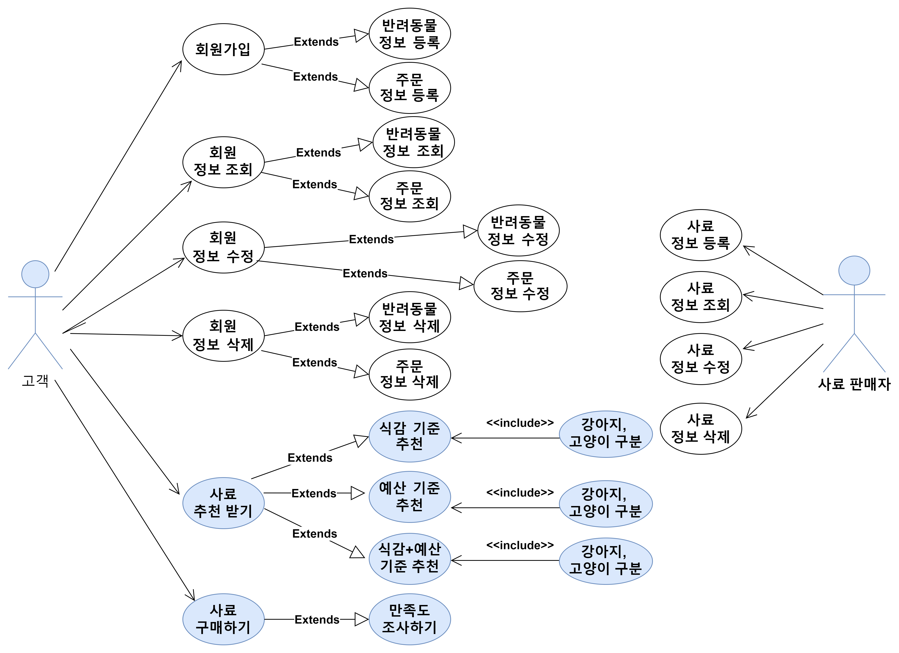
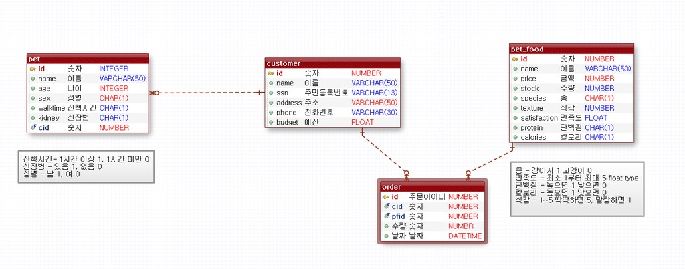
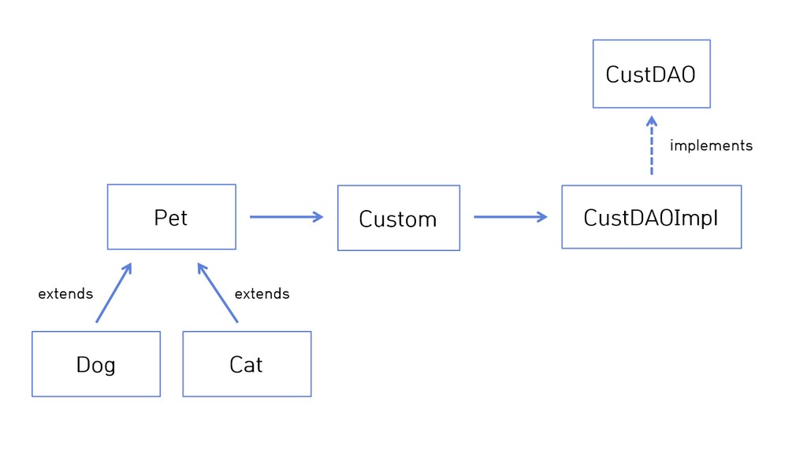
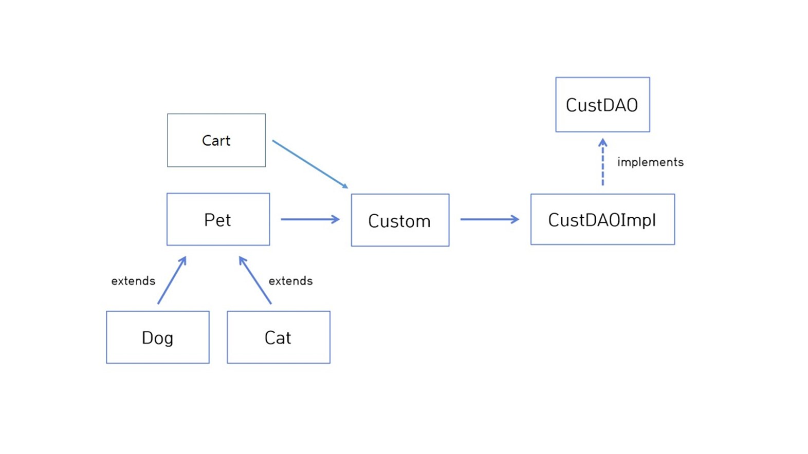
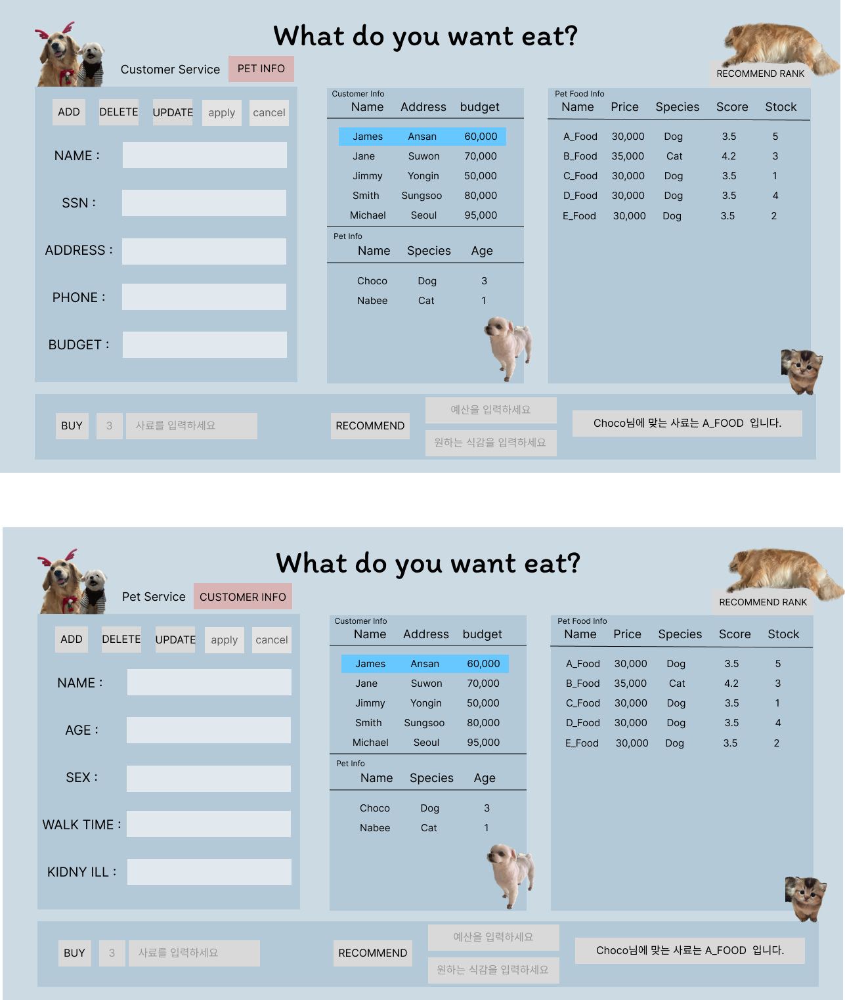

#### What do you Want to Eat? (WE)

# 사료 추천 및 구매 서비스 🏨
`Back-End` 코드와 `DB`를 연결해 강아지 또는 고양이 사료 추천 및 구매하는 서비스

## 0️⃣ 개발 환경

- ORACLE
- SQLDeveloper
- Eclipse
- JAVA 11 버전 
- Figma (Front UI 설계 툴)
- Draw.io (Usecase 설계 툴)

## 1️⃣ 팀원 소개

<table>
    <tr>
        <td align="center">
	    <a href="https://github.com/kanghl1111">
	    	
	    	<br/>
	    	<sub>
	    	<b>강혜리</b>
	    	<br/>
	    	
	        </sub>
	    </a>
	</td>
        <td align="center">
	    <a href="https://github.com/yu108kim">
	    	
	    	<br/>
	    	<sub>
	    	<b>김유완</b>
	    	<br/>
	    	
	        </sub>
	    </a>
	    <br />
	</td>
        <td align="center">
	    <a href="https://github.com/gaamjaa">
	    	
	    	<br/>
	    	<sub>
	    	<b>윤다인</b>
	    	<br/>
	    	
	        </sub>
	    </a>
	    <br />
	</td>
	<td align="center">
	    <a href="https://github.com/syoon6682">
	    	
	    	<br/>
	    	<sub>
	    	<b>정승윤</b>
	    	<br/>
	    	
	        </sub>
	    </a>
	    <br />
	</td>
</table>

<br/>


<br/>

## 2️⃣ Usecase Diagram 설계


<br/>

<br/>

기본적인 기능은 <span style="color: crimson">흰색 객체</span>, 사료 판매자는 <span 
style="color: skyblue">파란 객체</span>로 표현.

고객은 고객 정보에 대한 기본적인 CRUD 기능을 활용할 수 있음.

이때 고객 정보 조회시 반려동물 정보 조회, 주문 정보 조회를 확장되게 활용할 수 있고

이외의 기능에서도 반려동물과 주문정보에 대해 확장되게 활용할 수 있음.

그리고 추가 기능으로 `사료 추천 받기, 사료 구입하기` 기능을 활용할 수 있음 

사료 판매자는 사료에 대한 기본적인 CRUD 기능을 활용할 수 있음 

<br/>

## 3️⃣ DB 모델링

<br/>

<br/>

`eXERD` 를 이용해 **DB 모델링**

`Customer` (고객) 와 `Pet` (반려동물) 는 **서로 다 vs 다 관계**

각각 `PK` 를 `FK` 로 주어 1 vs 다 구조로 변경해주어야 함


<br/>

## 4️⃣ Class Diagram 구성


#### 기획 단계: 클래스 다이어그램이 필요없다고 생각 
- 강사님 피드백: 테이블명만이라도 적어 클래스 간의 관계를 명확히 밝힐 필요 있음
- 피드백 수용하여 클래스 다이어그램 작성 

####  1차 발표의 클래스 다이어그램 
<br/>

<br/>

- 피드백: 클래스 다이어그램에 주문(Cart) 테이블을 추가해야함

<br>

####  최종 발표의 클래스 다이어그램 
<br/>

<br/>


## 5️⃣ Interface 

```JAVA
public interface DatabaseTemplate {
	
	// JDBC Connect function
	Connection getConnect() throws SQLException;
	void closeAll(PreparedStatement ps, Connection conn)throws SQLException;
	void closeAll(ResultSet rs, PreparedStatement ps, Connection conn)throws SQLException;


	// Customer CRUD function
	void addCustomer(Customer cust)throws SQLException,DuplicateSSNException;
	Customer getCustomer(int id)throws SQLException,RecordNotFoundException;
	ArrayList<Customer> getAllCustomers() throws SQLException;
	void deleteCustomer(int id) throws SQLException,RecordNotFoundException;
	void updateCustomer(Customer cust) throws SQLException,RecordNotFoundException;
	
	// Pet CRUD function 
	void addPet(Pet pet)throws SQLException,DuplicateSSNException;
	Pet getPet() throws RecordNotFoundException;
	ArrayList<Pet> getAllPets() throws SQLException;
	void deletePet(int id)throws SQLException,RecordNotFoundException;
	void updatePet(Pet pet)throws SQLException,RecordNotFoundException;
	
	// Pet Food CRUD function
	void addPetFood(PetFood petFood)throws SQLException,DuplicateSSNException;
	PetFood getPetFood(int id) throws RecordNotFoundException;
	ArrayList<PetFood> getAllPetFoods() throws SQLException;
	void deletePetFood(int id)throws SQLException,RecordNotFoundException;
	void updatePetFood(PetFood petfood)throws SQLException,RecordNotFoundException;
	
	// Order CRUD function
	void addCart(Cart cart)throws SQLException,DuplicateSSNException;
	Cart getCart(int id) throws RecordNotFoundException;
	ArrayList<Cart> getAllCarts() throws SQLException;
	void deleteCart(int id)throws SQLException,RecordNotFoundException;
	void updateCart(Cart cart)throws SQLException,RecordNotFoundException;
	
	///// advanced service ////
	// recommend 
	PetFood recommPetFoodByBudget(Pet pet, int budget) throws SQLException;
	PetFood recommPetFoodByTexture(Pet pet, int texture) throws SQLException;
	PetFood recommPetFood(Pet pet, int budget, int texture) throws SQLException; 
	
	// buy food
	void buyPetFood(int budget, PetFood petfood, int quantity) throws SQLException;

	// Ranking
	ArrayList<PetFood> getRanking(int texture) throws SQLException;
	
  // log
	Cart getRecentCart(Customer cust) throws SQLException;
	ArrayList<Cart> getBestPetFoodMonth() throws SQLException;
}

```

<br/>

## 6️⃣ FE-UI 구현

- 구조화하고자 하는 화면을 직접 출력해봄으로써  
  추가할 부분을 생각할 수 있었음
- 고객부분과 키우는 애완동물 부분 두가지 화면을 구현

<br/>

<br/>

고객 서비스 부분에서 고객정보를 등록할 수 있다.

<br>
중복되는 고객 id 을 갖고 있을 경우 `Exception` 발생한다.

<br/>
<br>
고객은 `예산별`,`칼로리별`,`식감별`,`신장병 유무`에 따라 사료를 추천 받을 수 있다.

<br/>


<br/>

**좌측 pet Info 버튼을 누르면 pet의 `이름`, `성별`,`나이`, `산책시간`,`신장병 유무` 를 확인 할 수 있다. **

<br/>

<br> 가운데 테이블은 `이름`, `주민등록번호`, `주소`, `전화번호`, `예산`을 등록하고 해당 고객에 맞는 애완동물 정보와 고객 정보가 출력된다. 

<br/>
우측 테이블은 가격과 평점을 조합에 따라 추천순위를 출력해준다. 또한 하단 추천 사료 검색 서비스를 통해 
고객의 예산, 펫이 원하는 식감에 맞는 개인 추천 순위를 
볼 수 있다.

<br>
하단 좌측 구매수량을 선택하여 구매할 수 있다. 
예산이 부족할 경우 한도 초과로 해당 사료를 구매할 수 없다는  `Exception` 발생한다.


<br/>


<hr/>

## 7️⃣ 팀원들의 한마디

<br>
<table>
	<tr>
		<th style="text-align:center">팀 원</th>
		<th style="text-align:center; width: 220px;">좋았던 점</th>
		<th style="text-align:center; width: 220px;">아쉬웠던 점</th>
	<tr/>
	<tr>
		<td align="center">
			<a href="https://github.com/kanghl1111">
	    	
	    	<br/>
	    	<sub>
	    	<b >강혜리</b>
	    	<br/>
            </sub>
        	</a>
    	</td>
    	<td>기획, 설계 단계부터 각자 잘 할 수 있는 부분(ex. UI 설계, 다이어그램 그리기)은 분업하고, 그렇지 않은 부분(db에 데이터 입력, 추가 기능 구현)은 함께 하여
분업과 협업을 적절히 이용함</td>
    	<td>코드 컨벤션을 설정하지 않아 각자 코드를 짜고 합치는 과정이 시간이 매우 오래 걸림</td>
    <tr/>
	<tr>
		<td align="center">
			<a href="https://github.com/sjsin0905">
	    	
	    	<br/>
	    	<sub>
	    	<b>김유완</b>
	    	<br/>
	        </sub>
	    	</a>
    	</td>
    	<td>Impl 파일을 DAOImpl (CRUD 모음)과 ServiceImpl (추가 기능 모음) 구분을 통해
역할 구분 및 기능 구분을  효율적으로 해냄</td>
    	<td>깃 허브를 사용하지 않아 코드 공유 및 최신화 작업에서 충돌이 너무 많이 일어남</td>
    <tr/>
		<tr>
		<td align="center">
	    <a href="https://github.com/gaamjaa">
	    	
	    	<br/>
	    	<sub>
	    	<b>윤다인</b>
	    	<br/>
            </sub>
        </a>
    	</td>
    	<td>팀원 모두 수용적 성격이라 의견 충돌없이 긴 시간 회의도 잘 해냄</td>
    	<td>꼼꼼하게 인터페이스를 작성했다고 생각했지만 여기저기서 조금씩 잘못된 부분이 나왔고, 에러가 발생한 부분을 찾는데 오래 걸렸다는 점이 아쉬웠다.</td>
    <tr/>
    	<tr>
    	<td align="center">
        <a href="https://github.com/syoon6682">
        	
        	<br/>
        	<sub>
        	<b>정승윤</b>
        	<br/>
            </sub>
        </a>
    	</td>
    	<td>여러명이 함께하다보니 나의 부족한점을 보완해줄 수 있었다.</td>
    	<td>각자 아이디어가 너무 많다보니 설계에 시간을 지나치게 사용하는 등 시간 분배에 어려움을 겪었다.</td>
    <tr/>

</table>